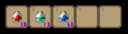

## Bienvenidos a la Memoria de Shiwasae Story


### Introducción

<div style="text-align: justify">
En este documento se detallarán las fases por las que nuestro equipo (DARPA Gamers) ha pasado para realizar “Shiawase Story”.
Está desarrollado puramente en Java con la librería de videojuegos “Slick2D”.
</div>
<br />

### Concepto del juego

<div style="text-align: justify">
Se trata de un videojuego RPG orientado a un público mayor de 12 años.
Pretende ser inmersivo con la historia y llevar al jugador poco a poco hacia el entendimiento total de la situación de la protagonista a medida que pasa satisfactoriamente los niveles. El objetivo final es sacar a la protagonista de la casa peligrosa.
</div>
<br />

Como características principales podemos destacar:
<br />
*	Ambientación detallada.
*	Música de fondo durante todo el juego.
*	Mapas grandes con numerosas escenas.
*	Distintos monstruos con distintas características.
*	Numerosos tipos de pociones.
*	Menú muy completo.
*	Simple en cuanto a controles.

<br />
### Historia del juego
<div style="text-align: justify">
Shiawase Story relata la aventura de la protagonista (<strong>Lire</strong>), que tendrá que adentrarse en la casa, pasando por cada nivel y derrotando a cada monstruo para poder escapar y descubrir el inicio de todo.
El juego está estructurado en tres niveles, con diferentes escenas dentro de cada nivel.
En el primer nivel, el juego comienza con la protagonista despertando en una casa gigante desconocida, está triste, asustada y confundida. El cuarto en el que está no le es familiar, sin embargo, investigando el lugar se da cuenta de que los objetos que hay desperdigados por los diferentes lugares sí, ¡son sus juguetes!
</div>
<br />
<div style="text-align: justify">
De repente, escucha de fondo unos ruidos espantosos que provienen de un cuarto, lentamente se va acercando a él y ve a un monstruo. Al principio se asustó, pero tras breves instantes le pareció extrañamente familiar, se parece mucho a una figurita de juguete de su hermano, ¡pero este está vivo!
Recordó que hace pocos días estuvo jugando con su hermano a “Monstruos y Brujas” y ella siempre conseguía matar al monstruo de su hermano con un juguete en específico… Un momento, ¡es el objeto que encontró en el cuarto en el que despertó!
Se armó de valor, entró al cuarto, y con el objeto derrotó al monstruo.
En el segundo nivel las cosas se complican un poco para la protagonista, ya ha tenido la primera toma de contacto con la casa, los objetos y los monstruos; no será tan fácil como antes.
</div>
<br />

<div style="text-align: justify">
Tras derrotar al monstruo, la protagonista creyó que estaría libre, total ¿qué más podría pasar? Para nada imaginaría que al otro lado de la puerta habría mucho más que recorrer hasta escapar de esa casa. La desesperación rápidamente invadió los pensamientos de la protagonista, sin embargo, ya no estaba tan triste, ahora sabe qué tiene que hacer: sobrevivir.
</div>
<br />

<div style="text-align: justify">
Finalmente, en el tercer nivel, tras vencer a todos los monstruos del nivel anterior la protagonista está muy confiada, sin embargo, tras la decepción de no encontrar la salida, poco a poco deja de tener miedo y se va acostumbrando a la casa y a los secretos que esconde.
Este mapa aparentemente se verá fácil, pero será el más complicado del juego. La protagonista al creer que todos los monstruos se derrotan de la misma forma, se acostumbrará a usar las mismas mecánicas, sin embargo, esto no será tan fácil en este mapa…
Cuando la protagonista jugaba con su hermano a “Monstruos y Brujas”, siempre perdía al final contra “El monstruo de los cristales”, este recuerdo le hará entrar en pánico cuando se dé cuenta de que se ha metido en su cueva.
Tras pasar satisfactoriamente el tercer nivel, Lire se despertará y se dará cuenta de que todo ha sido un sueño. Le dijo a su hermano que al fin había vencido a su monstruo más fuerte, aunque él nunca lo creería.
</div>
<br />

### Historia del personaje principal
<div style="text-align: justify">
La protagonista se despierta encerrada en una casa gigante con monstruos por doquier. Tendrá que descubrir cómo ha llegado hasta allí y cómo comenzó todo, además, poco a poco irá dándose cuenta de que los monstruos que se va encontrando le son extrañamente familiares y tendrá que encajar el puzle mental de todo lo que sucede a medida que avanza para intentar escapar.
</div>
<br />

### Mecánicas del juego
<div style="text-align: justify">
Los controles los podemos resumir en esta imagen creada e implementada dentro del juego para que el jugador pueda consultarla siempre que quier desde el menú de pausa, o desde el menú principal. 
</div>
<br />
<div style = "text-align:center">

</div>
<br />
<div style="text-align: justify">
Despues de testear el juego con personas externas al desarrollo nos dimos cuenta que la utilidad de las pociones, era poco evidente y poco perceptible, por lo que hemos creado un botón que te arroje toda la información sobre las pociones. Tipo, duración, explicación, imagen de la poción entre otras coasas.
El cuadro informativo se puede acceder a él mediante el tabulador, y no detiene el flujo de funcionamiento del nivel.
</div>

<br />
<div style = "text-align:center">

</div>
<br />
<div style="text-align: justify">
 Estas pociones, podrán ser obtenidas de los distintos cofres que haya en el nivel. La localización de los cofres es constante en las distintas escenas de cada nivel, pero el contenido de los mismos no. 
 </div>
<br />
<div style = "text-align:center">

</div>
 
<br />
<div style="text-align: justify">
 Hemos aplicado un factor RNG en la creación de los cofres, dando una serie de probabilidades a cada tipo de poción. Con esto conseguimos que la experiencia de pasarse el juego una vez sea completamente distinta a pasárselo otra con otros tipos de pociones. Este aleatorización de los cofres con probabilidades se ha llevado a cabo con el siguiente código.
</div>
 
<br />
```java
/**
     * 
     * Según la definicion de Laplace de probabilidad 
     *   
     *       Suponemos que todos los posibles numeros aleatorios generados por el obj random 
     *       son equiprobables, entonces con nuestra condicion del if estamos consiguiendo una prob tal 
     *       que sería el numero de casos favorables entre todos los posibles resultados del experimento.
     *   
     *       En el primer caso tendríamos 1/12 de probabilidad(8.33%). Escogemos un posible valor
     *       en nuestros caso el 0(nos genera numeros de 0 - 11) entre todos los posibles valores generados.
     *   
     *       La probabilidad de cumplir esa condicion es de un 8.33%
     *   
     *       Id_pociones: 0 == hp
     *                    1 == velo
     *                    2 == exp
     *                    3 == Invulnerabilidad
     *                    4 == Fuerza
     */
    public void cargar_id_pociones_probabilidad(){
        
        //Invulnerabilidad
        if(0 == new Random().nextInt(12)){
            this.lista_id_pociones.add(3);
        
        //Fuerza
        } else if(0 == new Random().nextInt(6)){
            this.lista_id_pociones.add(4);
        
        //Velo
        }else if(0 == new Random().nextInt(3)){
            this.lista_id_pociones.add(1);
        
        //Hp
        }else if(0 == new Random().nextInt(2)){
            this.lista_id_pociones.add(0);
        }
        
        //Exp siempre vamos a dar por abrir un cofre, lo que será aleatorio será el numero de esxp que vamos a dar
        // Vamos a dar de 1 - 3 botellas de exp
        int exp = (new Random().nextInt(3) +1);
        for(int i = 0; i <exp; i++){
            this.lista_id_pociones.add(2);
        }
        
    }

```
<br />
<div style="text-align: justify">
 Los cofres pueden ser recogidos por el jugador una única vez, lo hará pulsando la tecla R (Recoger) siempre que esté en un área próxima al cofre.
 Esto sea ha implementado con dos polígonos, uno para manejar las colisiones con el cofre y otro para detectar si está en un área próxima al cofre.
</div>
<br />
<div style = "text-align:center">

</div>
<br />
<br />
<div style = "text-align:center">

</div>
<br />
<div style="text-align: justify">
Todas las pociones recogidas por el jugador se irán añadiendo al inventario. El inventario está conformado de 5 slots con capacidad de 9 pociones por slot.
 Si el usuario recoge una poción, y el slots de ese tipo está lleno se descartará. Las pociones se pueden consumir pulsando la tecla numérica asociada al slots del inventario.
</div>
<br />
<div style = "text-align:center">

</div>
<br />

#### Personaje principal
<br />
<div style="text-align: justify">
Todas las pociones recogidas por el jugador se irán añadiendo al inventario. El inventario está conformado de 5 slots con capacidad de 9 pociones por slot.
 Si el usuario recoge una poción, y el slots de ese tipo está lleno se descartará. Las pociones se pueden consumir pulsando la tecla numérica asociada al slots del inventario.
</div>
<br />

[Descargar versión PDF ](./data/)

----

[Volver a la página principal](./)
